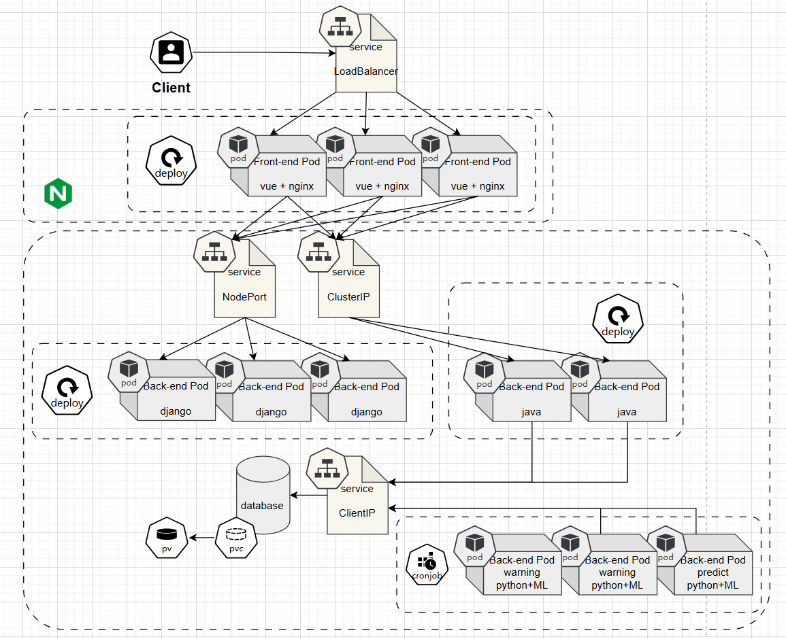

# Cloud-on-Cloud

Team Member:

- Student 1: [Liang Wenjie], [t0933438@u.nus.edu], [allenlion1923@gmail.com], [https://github.com/lonilow].
- Student 2: [Jiang Guanyu], [t0933423@u.nus.edu], [3220104991@zju.edu.cn], [https://github.com/DjangoJungle].
- Student 3: [Shen Yipeng], [t0933846@u.nus.edu], [3220101827@zju.edu.cn], [https://github.com/lazyyy77].
- Student 4: [Xu Ruikang], [t0933511@u.nus.edu], [3220105566@zju.edu.cn], [https://github.com/xrkkkt].


## 1. Project Overview

The project of NUS SOC 2024, SWS3004-Cloud Computing with Big Data. The members of our group - group2 - Waffle Rush are: Liang Wenjie, Xu Ruikang, Jiang Guanyu, Shen Yipeng.


### 1.1 Project Description

This project is for weather informing and forecasting, to create a community and achieve collaborating, preparation-making,  resources-sharing and life-saving.

It showcasing the current weather conditions, providing the outdoor tips, predicting the future weather, as well as supporting an on-line weather-chatting-room for information sharing.


### 1.2 System Architecture




### 1.3 Key Components

- **Component 1**: Frontend-Part: using vue to design the router/pages, using nginx as web-server and handling the reverse proxy.
- **Component 2**: Backend-Part with Django: response to the data request from the front-end's weather page by selecting and handling information from database.
- **Component 3**: Backend-Part with Java: response to the data request from the front-end's chatbox by selecting\inserting\updating information from database.
- **Component 4**: Backend-Part with Python&ML: calling the api to get the latest weather information while inserting them into the database. Using LSTM/spark to predict the future weather with timestamp.
- **Component 5**: Backend-Part with Kafka: still developing. Creating and dealing with the stream data by compress a long period of time to few seconds.


## 2. Environment Setup

### 2.1 Prerequisites

- node >= 20.11.0
  - https://github.com/coreybutler/nvm-windows/releases/download/1.1.12/nvm-setup.exe

- npm >= 10.4.0
  + `nvm install 20.11.0`
- Apache Maven >= 3.9.6  https://maven.apache.org/download.cgi
- OpenJdk >= 22  https://jdk.java.net/22/
- Kafka >= 29.3.10 `helm install my-kafka bitnami/kafka --version 29.3.10`
- Django >= 4.2.3 `py -m pip install Django==4.2.3`
- django-cors-headers `pip install django-cors-headers`
- django-environ >= 0.10.0 `pip install "django-environ>=0.10.0"`
- gunicorn >= 20.0.4 `pip install "gunicorn>=20.0.4"`


### 2.2 Installation

The following steps can help you to run the different parts of the project in developing mode.

#### 2.2.1 **Step 1**: Build the Backend-Weather

Notice: You need to change the database configuration belows to your own. To know more, check the readme in `/src/Backend-Weather/readme.md`.

+ weatherApp_backend/weatherApp_backend/settings.py 

+ kube-yaml/mysql-deployment.yaml

+ kube-yaml/weatherapp-backend-deployment.yaml

```bash
python manage.py makemigrations
python manage.py migrate
python manage.py runserver ${your ip address}:${your port}
```


#### 2.2.2 **Step 2**: Build the Backend-Information

There will be a more detailed guide in `/src/Backend-Information/readme.md`

```bash
python get_weather.py
python get_warning.py
python get_predict.py
```


#### 2.2.3 **Step 3**: Build the Backend-Chatroom

There will be a more detailed guide in `/src/Backend-Chatroom/readme.md`

```bash
mvn clean compile
mvn exec:Java
mvn clean package
```


#### 2.2.4 **Step 4 (Optional)**: Build the Backend-Kafka

There will be a more detailed guide in `/src/Backend-Kafka/readme.md`

```bash
cd kafka-29.3.8/kafka
helm install -n kafka kafka .
```


#### 2.2.5 **Step 5**: Build the Frontend-Release

There will be a more detailed guide in `/src/Frontend-Release/readme.md`

```bash
npm install
npm run dev
npm run build
```


## 3. Application Deployment

The following steps can help you to deploy the different parts of the project on k8s with production mode. It directly uses the images create by the dockerfile of each parts.

Please run the commands under the deployment folder:


### 3.0 AWS

+ connect to your aws account with AWS CLI.
+ create an EKS cluster with 2 node groups, whose labels `nodegroup` 's value equal to FrontendGroup / BackendGroup.

 

### 3.1 Service
+ fsvc.yaml -- LoadBalancer -- expose front-end
  `kubectl apply -f ./1svc/fsvc.yaml`
+ bwsvc.yaml -- NodePort -- expose back-end-weather
  `kubectl apply -f ./1svc/bwsvc.yaml`
+ bcsvc.yaml -- ClusterIP -- expose back-end-chatbox
  `kubectl apply -f ./1svc/bcsvc.yaml`
+ msvc.yaml -- ClusterIP -- expose mysql
  `kubectl apply -f ./1svc/msvc.yaml`


### 3.2 Database
+ mpv.yaml -- persistent volume
  `kubectl apply -f ./2db/mpv.yaml`
+ mpvc.yaml -- persistent volume claim
  `kubectl apply -f ./2db/mpvc.yaml`
+ mconfig.yaml -- ConfigMap
  `kubectl apply -f ./2db/mconfig.yaml`
+ msecret.yaml -- Secret -- password
  `kubectl apply -f ./2db/msecret.yaml`
+ mysql.yaml -- database
  `kubectl apply -f ./2db/mysql.yaml`
+ exec m-dep pod
  - `kubectl exec -it ${your sql pod name} -- sh`
  - execute `mysql -u root -p`
  - pwd =  `12345678`
  - execute `create database weather;`


### 3.3 Backend & Database Initialize
+ bwdep.yaml -- deployment -- backend-weather
  - `kubectl apply -f ./3be/bwdep.yaml`
  -  `kubectl autoscale deployment bw-dep --cpu-percent=50 --min=2 --max=5`
  - exec bw-dep pods
    - `kubectl exec -it ${your sql pod name} -- sh`
    - execute `python manage.py makemigrations`
    - execute `python manage.py migrate`
+ bcdep.yaml -- deployment -- backend-chatbox
  - `kubectl apply -f ./3be/bcdep.yaml`
  - `kubectl autoscale deployment bc-dep --cpu-percent=50 --min=1 --max=5`


### 3.4 Jobs
+ warning_cj.yaml -- job -- provide warning
  - `kubectl apply -f ./4cj/warning_cj.yaml`
+ weather_cj.yaml -- job -- provide weather
  - `kubectl apply -f ./4cj/weather_cj.yaml`
+ predict_cj.yaml -- job -- provide predict
  - `kubectl apply -f ./4cj/predict_cj.yaml`


### 3.5 Frontend
+ fdep.yaml -- deployment -- front-end
  - `kubectl apply -f ./5fe/fdep.yaml`
  - `kubectl autoscale deployment f-dep --cpu-percent=50 --min=2 --max=10`